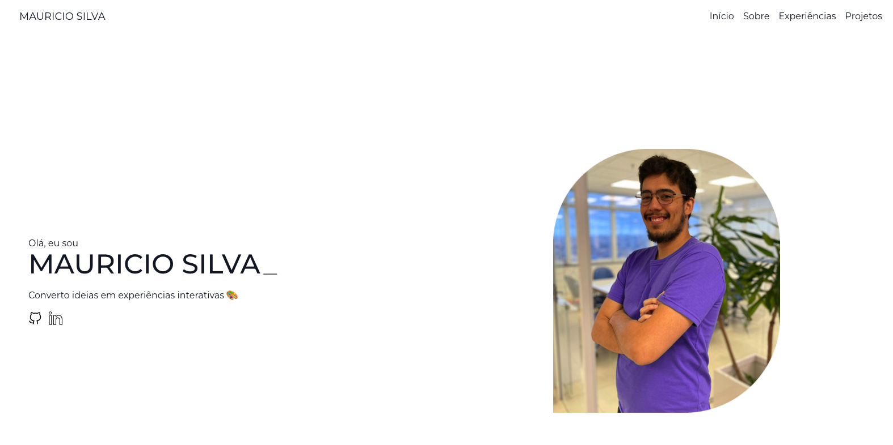

<a id="readme-top"></a>
[![LinkedIn][linkedin-shield]][linkedin-url]

silvasmvs@gmail.com

Project Link: [https://github.com/silvasmvs/silvasmvs.github.io](https://github.com/silvasmvs/silvasmvs.github.io)


<!-- PROJECT LOGO -->
<br />
<div align="center">
  <a href="https://github.com/silvasmvs/silvasmvs.github.io">
    
  </a>
  <h2 align="center">Meu Portfólio</h2>
  <a target="_blank" href="https://silvasmvs.github.io/">Acessar</a>
</div>

<!-- SUMMARY -->
<details>
  <summary>Sumário</summary>
  <ol>
    <li>
      <a href="#sobre-o-projeto">Sobre o projeto</a>
      <ul>
        <li><a href="#design-do-figma">Design do Figma</a></li>
        <li><a href="#tecnologias">Tecnologias</a></li>
      </ul>
    </li>
    <li>
      <a href="#começando">Começando</a>
      <ul>
        <li><a href="#pré-requisitos">Pré Requisitos</a></li>
        <li><a href="#instalação">Instalação</a></li>
      </ul>
    </li>
    <li><a href="#licença">Licença</a></li>
    <li><a href="#contato">Contato</a></li>
  </ol>
</details>


<!-- ABOUT THE PROJECT -->
## Sobre o projeto

Este projeto é um portfólio desenvolvido com o objetivo de mostrar em uma landing page, as minhas habilidades e experiências de maneira mais detalhada e de forma mais visual.

### Design do Figma

<a target="_blank" href="https://www.figma.com/design/Zt9j8zGMMTEVYw7OPwGJdi/Personal-Portfolio-Template-%7C-Mobile-%26-Desktop-(Community)?node-id=0-1&t=G1dvjn9D0ye0gLnw-1">
  Link
</a>


<p align="right">(<a href="#readme-top">back to top</a>)</p>


### Tecnologias

* [![Next][Next.js]][Next-url]
* [![React][React.js]][React-url]
* [![Typescript][Typescript]][Typescript-url]
* [![Tailwind][Tailwind]][Tailwind-url]
* [![Figma][Figma]][Figma-url]

<p align="right">(<a href="#readme-top">back to top</a>)</p>

<!-- GETTING STARTED -->
## Começando

Para visualizar o resultado esse projeto, apenas é necessário instalar as dependências 

```sh
  npm install
```

E depois, só rodar o comando de desenvolvimento

```sh
  npm run dev
```

<p align="right">(<a href="#readme-top">back to top</a>)</p>

<!-- MARKDOWN LINKS & IMAGES -->
[license-shield]: https://img.shields.io/github/license/othneildrew/Best-README-Template.svg?style=for-the-badge
[license-url]: https://github.com/othneildrew/Best-README-Template/blob/master/LICENSE.txt
[linkedin-shield]: https://img.shields.io/badge/-LinkedIn-black.svg?style=for-the-badge&logo=linkedin&colorB=555
[linkedin-url]: https://www.linkedin.com/in/silvasmvs/

[Next.js]: https://img.shields.io/badge/next.js-000000?style=for-the-badge&logo=nextdotjs&logoColor=white
[React.js]: https://img.shields.io/badge/React-20232A?style=for-the-badge&logo=react&logoColor=61DAFB
[Typescript]: https://img.shields.io/badge/Typescript-20232A?style=for-the-badge&logo=typescript&logoColor=3178C6
[Tailwind]: https://img.shields.io/badge/Tailwind-20232A?style=for-the-badge&logo=tailwindcss&logoColor=#06B6D4
[Figma]: https://img.shields.io/badge/Figma-20232A?style=for-the-badge&logo=figma&logoColor=#F24E1E


[React-url]: https://reactjs.org/
[Next-url]: https://nextjs.org/
[Typescript-url]: https://www.typescriptlang.org/
[Tailwind-url]: https://tailwindcss.com/
[Figma-url]: https://www.figma.com/